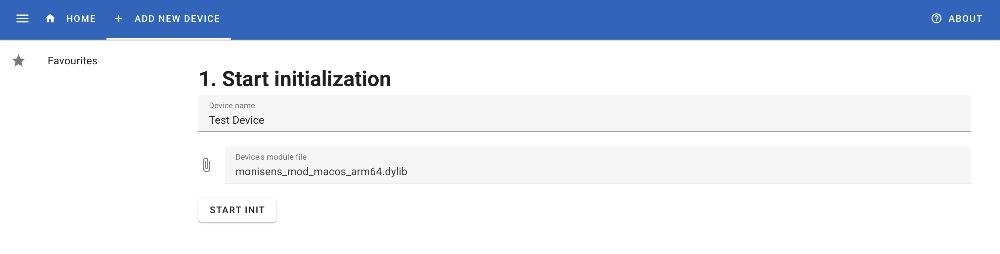
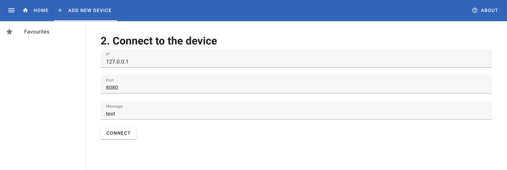
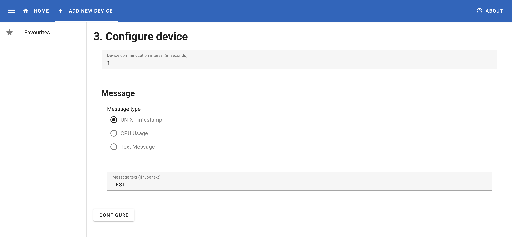
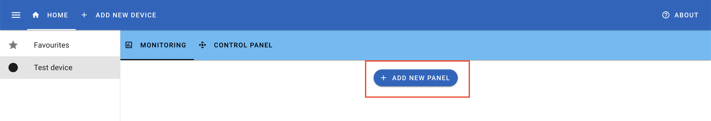
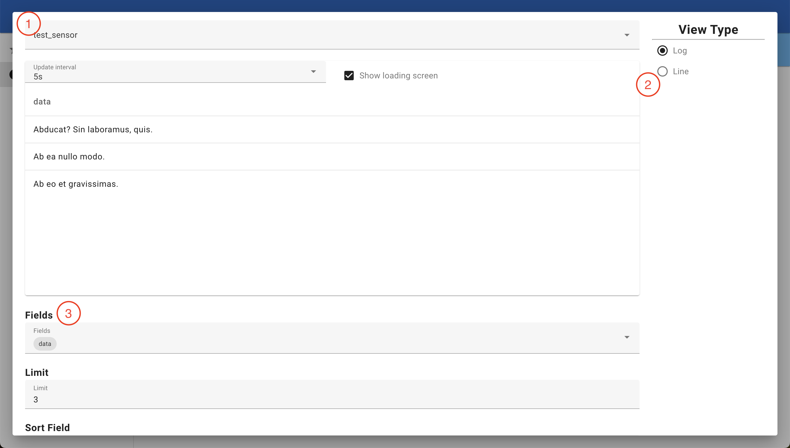
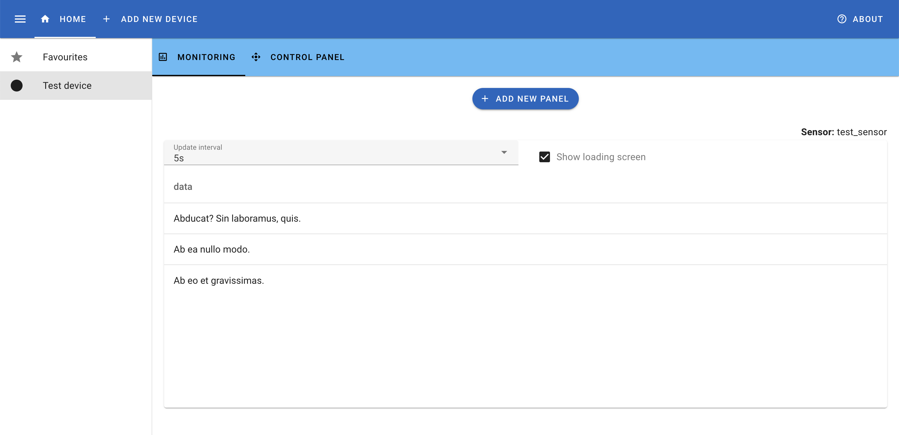

# Monisens

**Monisens** is an open-surce SCADA system that allows to connect any source of data, from sensor to database, and collect information from it and represent it in various variants (e.g. Table or Graph). This flexibility is achieved with fully cutomiseable modules implemented as dynamic libraries.

This project is in a pretty raw state, but it can be used as an inspiration or as a source of features (such as SQL query builder or module for communication with dynamic libraries). Feel free to use it as you like (a mention in your projects will be appreciated ;) ).

## TODO

- [ ] Improve architecture: better separation of business logic from implementation details
- [ ] Tests for all processes
- [ ] Separated modules' instances (defence against segfaults, panics, etc.)
- [ ] Device configuration validation
- [ ] Ability to change device configuration
- [ ] Simplify creation of new modules with macros
- [ ] Common modules (Modbus, MQTT, etc.)
- [ ] More error codes for modules (IO error, timeout, etc.)
- [ ] Improve monitoring: realtime monitoring, add new View types, ability to combine data from several sensors, data aggregation and more
- [ ] Configurable data stores (e.g. Redis, MQTT)
- [ ] And many more to come!

## How to use

### Prepare infrastructure

Before starting MoniSens, you need to spin up a PostgreSQL database. For testing, you can use a [docker-compose file](docker-compose.yaml) provided by this repo.

### Start the service

In order to start the MoniSens service, you can use pre-built binaries from [releases](https://github.com/br3w0r/monisens/releases) or build from source using `cargo`.

When `app_data` is mentioned, it's `app_data` folder in this repo. It contains all files for frontend. Alternatively, you can build it by yourself from [this repo](https://github.com/br3w0r/monisens-frontend).

**If you use pre-build binaries:**
- Download an executable for your platform and architecture, and an `app_data` archive.
- Extract the archive that should contain `app_data` folder.
- Move the executable to the same directory where `app_data` is placed.
    - Alternatively, you can use a `MONISENS_APP_DATA` env variable to specify where the `app_data` folder is placed:
        ```bash
        $ MONISENS_APP_DATA=/home/user/monisens/app_data monisens
        ```
- Run the executable.

**If you build from source:**
- Build the service using `cargo build` command.
- Move the executable to the same directory where `app_data` is placed.
    - `app_data` is in the root directory of the repo. You can copy it wherever you like.

**Command-line arguments**

Use `monisens -h` to get info about available command-line arguments.

By default, MoniSens runs at `localhost:8888` and uses a database started by the [docker-compose file](docker-compose.yaml).

### Adding a module

#### Download a module

In order to use the service, you need to obtain a module which is a dynamic library compiled for your OS and architecture:
- .dll for Windows
- .so for Linux
- .dylib for MacOS

There's an example module which doesn't require any hardware: [monisens_mod](https://github.com/br3w0r/monisens_mod/). You can use it to start.
1. Download the last version of the module and a web server from the [releases section](https://github.com/br3w0r/monisens_mod/releases).
2. Start the web server

#### Initialize the module

To initialize the module, start by clicking the "Add New Device" button, which will open a module initialization page. Enter a device name and choose the module's file.

> For the name, use English characters (a-z, A-Z), numbers (0-9) and spaces.



Then, click "Start Init" to proceed to a connection stage. There, you need to fill all parameters to configure connection to the test server we started earlier. Just enter all field as in the image. Click "Connect" to proceed to the next step.



At a configuration step, you can tune some parameters that are provided by the module. In the test module, only "Device communication interval" makes any difference on the result we get. It changes the frequency at which new records are generated. After setting up, click "Configure" to finish adding a new device.

> **Note**: the test module is very primitive, so it doesn't store the configuration. After a restart of MoniSens, it'll have the communication interval set to `1` and message type set to `UNIX Timestamp`.



Now, you can click on the device on the left menu to open a panel page.


### Adding a Panel

Click "Add new panel" to open a new dialog window.



Here, you can see several parameters you can change:
1. "Sensor", or a data source to be general.
2. View type. Now, MoniSens supports only 2 types:
    - Log – a table-like view
    - Line – a simple chart
3. View parameters which affect the way what data is displayed and how it's displayed



At the bottom of the window you'll find a "Save" button which will store the panel in the database. Then, you can always go to the device's page and monitor data on panels.



### FAQ

- Where MoniSens stores its data?
    - Windows: in the root directory of the program: `<root_dir>/.monisens`
    - Linux: `~/.monisens`
    - MacOS: `~/Library/Application Support/monisens/`

## API

MoniSens supports OpenAPI Specification with Swagger served at `<host>/docs`.

Below is an explanation on how to add and use a device with API calls. For each API call, an example of usage with the test module is given.

### Add a new device

To add a new device call URLs in the following order:
1. `/service/start-device-init`
    - `device_name`: `Test Device API`
    - `module_file`: `monisens_mod_macos_arm64.dylib`
2. `/service/connect-device`
    > Here, we use the response from the previous URL to fill in the request.
    ```json
    {
        "device_id": 1,
        "connect_conf": [
            {
                "name": "IP",
                "value": {
                    "String": "127.0.0.1"
                }
            },
            {
                "name": "Port",
                "value": {
                    "Int": 8080
                }
            },
            {
                "name": "Message",
                "value": {
                    "String": "test message"
                }
            }
        ]
    }
    ```
3. `/service/obtain-device-conf-info`
    > A response from this handler will be used in the next one.
    ```json
    {
        "device_id": 1
    }
    ```
4. `/service/configure-device`
    ```json
    {
        "device_id": 1,
        "confs": [
            {
                "id": 1,
                "data": {
                    "Int": 10
                }
            },
            {
                "id": 2,
                "data": {
                    "ChoiceList": 2
                }
            },
            {
                "id": 3,
                "data": {
                    "String": "TEST"
                }
            }
        ]
    }
    ```

### Add a new panel

Adding a new panel is pretty simple:
1. `/service/get-device-sensor-info`
    ```json
    {
        "device_id": 1
    }
    ```
2. `/service/save-monitor-conf`
    ```json
    {
        "device_id": 1,
        "sensor": "test_sensor",
        "typ": "Log",
        "config": {
            "Log": {
            "fields": [
                "data",
                "timestamp"
            ],
            "limit": 30,
            "sort_direction": "DESC",
            "sort_field": "timestamp"
            }
        }
    }
    ```

## Example modules

- [monisens_mod](https://github.com/br3w0r/monisens_mod/)
    - The simpliest module that makes use of the most MoniSens features: custom fields for connection and configuration, and data sending from a separated thread. Unfortunately, it doesn't make use of data folder to store configuration (for now).
- [monisens_serial](https://github.com/br3w0r/monisens_serial)
    - Implements the most basic serial communication using `serialport` library. Doesn't save configuration to the data folder.
- [monisens_wifi](https://github.com/br3w0r/monisens_wifi)
    - Communication over internet using TCP protocol. Saves configuration to the data folder.
- [monisens_mqtt](https://github.com/br3w0r/monisens_mqtt)
    - Implements simple communication over MQTT. Saves configuration to the data folder.

## How to implement your module

> **Note:** current API is very raw and will certainly change (e.g. new error codes will be added, API for connection to device may be changed entirely). Moreover, it's not stabilised, so these changes may break your modules as they will be added to the first version of the API.

Modules may be made in any language compatible with C API, but only Rust implementation was tested.

There're 2 files that describe a Module API for MoniSens:
1. API for functions: [module/monisens_api.h](module/monisens_api.h)
    - There, you can find descriptions on every function used in the API.
2. Type definitions: [module/monisens_def.h](module/monisens_def.h)
    - This file contains contracts for communication between a module and MoniSens.

These files may be used with [rust-bindgen](https://github.com/rust-lang/rust-bindgen) to simplify implementation of a module.

**The easiest way** to make a module in Rust is to use a [monisens_bindings](https://github.com/br3w0r/monisens_bindings). It provides basic Rust FFI bindings  (using `rust-bindgen`) and abstractions that encapsulate most of details about conversion of C types to Rust and vice-versa.

To start with, you can grab the test module ([monisens_mod](https://github.com/br3w0r/monisens_mod/)) and change it to your needs. You can also look at all the other example modules from the previous section.

## Known issues

1. Unable to continue configuring new device if the page is reloaded.
    - For now, you need to complete adding a new device without page reloads.
2. Error handling when creating a new panel (on frontend).
    - It's not implemented yet.
3. Message handler panics on any error
